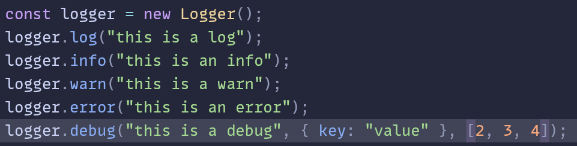
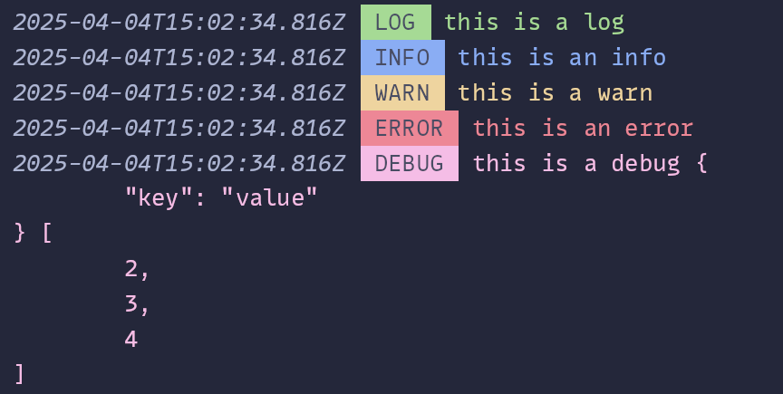

# **HNLOG**
- A simple colorful logging library for javascript with typescript support <br />
-  <br />
-  <br />

## **Installation** ⬇️
- `bun add hnlog` or `npm i hnlog`

## **Usage** 📚
```
    import Logger from 'hnlog';
    const logger = new Logger();
    logger.DEBUG('Hello World!');
```

## **Config** ⚙️
```
const logger = new Logger({
  logFileName: "app.log", // specify log file name
  logFile: false, // enable logging to file
  bracket: false, // enable bracket around log level
  color: true, // enable color
  timestamp: true, // enable timestamp
  localTimestamp: false, // enable local timestamp
})
```
